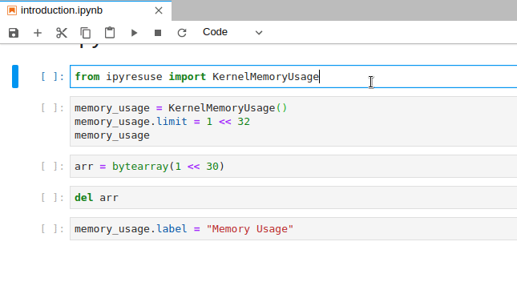

# ipyresuse

Jupyter Widget to display resources used by the kernels.

Inspired by the notebook server extension [nbresuse](https://github.com/yuvipanda/nbresuse) and the [system-monitor](https://github.com/jtpio/jupyterlab-system-monitor) extension for JupyterLab.




## Installation

You can install using `pip`:

```bash
pip install ipyresuse
```

Or if you use jupyterlab:

```bash
pip install ipyresuse
jupyter labextension install @jupyter-widgets/jupyterlab-manager
```

If you are using Jupyter Notebook 5.2 or earlier, you may also need to enable
the nbextension:
```bash
jupyter nbextension enable --py [--sys-prefix|--user|--system] ipyresuse
```
